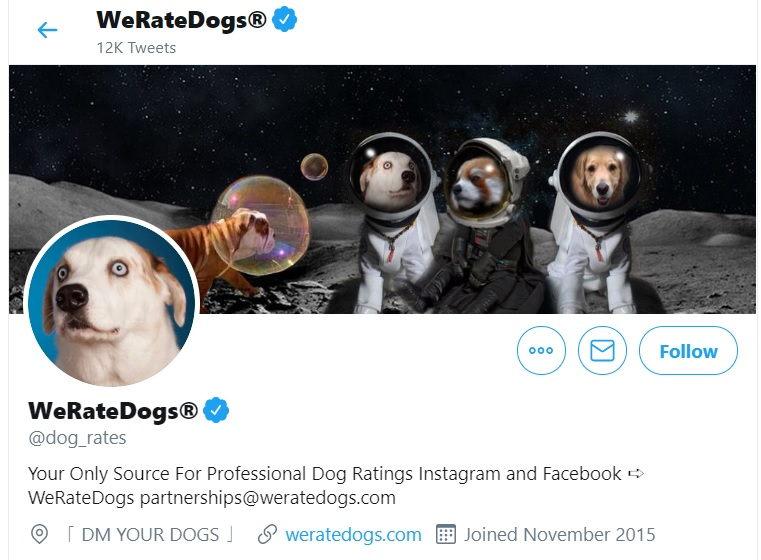

# Data wrangling, analyse and visualisation for twitter acount WeRateDogs

[WeRateDogs](https://twitter.com/dog_rates) is twitter account for rating tweets with funny content related to dogs. I have analysed 1958 dog tweets which were posted on the account in period from 15th November 2015 to 1st August 2017. I tried to find out what kind of tweets get most popularity (likes and retweets) among twitter users. This was study project for online course [Data Analyst Nanodegree from Udacity](https://www.udacity.com/course/data-analyst-nanodegree--nd002).

Source: [WeRateDogs](https://twitter.com/dog_rates)

### Instalation

- Jupyter Notebook
- Python 3.6
- Anaconda

### Methods used

- data gathering from 3 different sources (provided csv file from twitter archive, tsv file stored on URL accessed via Requests library and additional data about tweets stored as JSON objects in Tweepy library)
- data assessing and cleaning done with Python libraries Pandas and Numpy
- data analysis and visualisation done with Pandas, Numpy and Matplotlib

### Conclusion and main findings

Best day for posting a tweet to get attention of fans of WeRateDogs is on Wednesdays. Tweets containing videos instead of photos get on average 2,7 times more likes and 4 times more retweets. Very popular dog breeds in terms of gaining likes and retweets were Bedlington Terrier, Afghan Hound, French Bulldog and Saluki.

Data did not show that tweets with puppies would be more popular than tweets depicting adult dogs. Actually, we observed quite the opposite, tweets without puppies were getting more likes and retweets. This might be caused by my labeling of tweets with/without puppies was based on occurence of words related to puppy, pup etc. in text of the tweet.

### Authors

* **Kamila Hamalcikova**
* **Udacity**

### License

This project is licensed under the MIT License - see the [license](https://opensource.org/licenses/MIT) file for details
